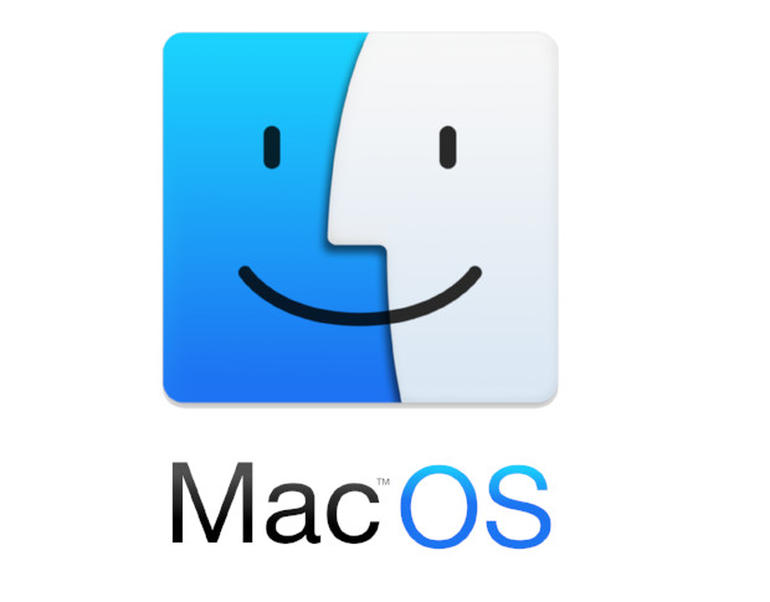

<!DOCTYPE html>
<!-- saved from url=(0048)https://getbootstrap.com/docs/5.0/examples/blog/ -->
<html lang="en"><head><meta http-equiv="Content-Type" content="text/html; charset=UTF-8">
    
<meta name="labels" content="Technology, Programming, developing">
<meta name="Category" content="Technology">
<meta name="author" content="Jose Caicedo">
<meta name="date" content="Tuesday, March 23th, 2020, 5:19 pm">

    <title>Blog de Prueba</title>

    <link rel="canonical" href="https://getbootstrap.com/docs/5.0/examples/blog/">
<link href="https://cdn.jsdelivr.net/npm/bootstrap@5.0.0-beta3/dist/css/bootstrap.min.css" rel="stylesheet" integrity="sha384-eOJMYsd53ii+scO/bJGFsiCZc+5NDVN2yr8+0RDqr0Ql0h+rP48ckxlpbzKgwra6" crossorigin="anonymous">

    

    <!-- Bootstrap core CSS -->
<link href="./Blog Template · Bootstrap v5.0_files/bootstrap.min.css" rel="stylesheet" integrity="sha384-BmbxuPwQa2lc/FVzBcNJ7UAyJxM6wuqIj61tLrc4wSX0szH/Ev+nYRRuWlolflfl" crossorigin="anonymous">

    <!-- Favicons -->
<link rel="apple-touch-icon" href="https://getbootstrap.com/docs/5.0/assets/img/favicons/apple-touch-icon.png" sizes="180x180">
<link rel="icon" href="https://getbootstrap.com/docs/5.0/assets/img/favicons/favicon-32x32.png" sizes="32x32" type="image/png">
<link rel="icon" href="https://getbootstrap.com/docs/5.0/assets/img/favicons/favicon-16x16.png" sizes="16x16" type="image/png">
<link rel="manifest" href="https://getbootstrap.com/docs/5.0/assets/img/favicons/manifest.json">
<link rel="mask-icon" href="https://getbootstrap.com/docs/5.0/assets/img/favicons/safari-pinned-tab.svg" color="#7952b3">
<link rel="icon" href="https://getbootstrap.com/docs/5.0/assets/img/favicons/favicon.ico">
<meta name="theme-color" content="#7952b3">

    

    
    <!-- Custom styles for this template -->
    <link href="./Blog Template · Bootstrap v5.0_files/css" rel="stylesheet">
    <!-- Custom styles for this template -->
    <link href="./Blog Template · Bootstrap v5.0_files/blog.css" rel="stylesheet">
  </head>

  <body>
    

  <header class="blog-header py-3">
    

      

        <a class="link-secondary" href="file:///C:/Users/Altadata/Desktop/Nueva%20carpeta%20(2)/login.html">Subscribete</a>
      

      

                    
      

      

        
        <a class="btn btn-sm btn-outline-secondary" href="file:///C:/Users/Altadata/Desktop/Nueva%20carpeta%20(2)/login.html">Inicia Sesión</a>
      

    

  </header>
         <section id="#hero" class="">

  

    <nav class="nav d-flex justify-content-between">
   

      <a class="p-2 link-secondary" href="#sistemas">Sistemas Operativos</a>
      <a class="p-2 link-secondary" href="#android">Android</a>
      <a class="p-2 link-secondary" href="#ios">Ios</a>
      <a class="p-2 link-secondary" href="#autos">Autos</a>
      <a class="p-2 link-secondary" href="#aviacion">Aviación</a>
      <a class="p-2 link-secondary" href="#ia">IA</a>
      <a class="p-2 link-secondary" href="#fb">Facebook</a>
         <a class="p-2 link-secondary" href="#lp">Lenguajes de Programación</a>
      <a class="p-2 link-secondary" href="#rt">Robots</a>
      <a class="p-2 link-secondary" href="#md">Marketing Digital</a>
    </nav>
  

<main class="container">
 
  
 

   

      

        

          <strong class="d-inline-block mb-2 text-success">Programación</strong>
          <h3 class="mb-0">Lenguajes</h3>
          
Mar 23

          
Informate sobre los lenguajes de programación mas demandados para 2021

          <a href="https://getbootstrap.com/docs/5.0/examples/blog/#" class="stretched-link">Continuar leyendo</a>
        

        

          
        

      

    

  

  

    

      

        

          <strong class="d-inline-block mb-2 text-primary">Robots</strong>
          <h3 class="mb-0">El Futuro</h3>
          
Mar 23

          
Así es Roomiebot, el robot mexicano que está ayudando a diagnosticar el coronavirus

          <a href="https://getbootstrap.com/docs/5.0/examples/blog/#" class="stretched-link">Continuar leyendo</a>
        

        

          

        

      

    

    

      

        

          <strong class="d-inline-block mb-2 text-success">Marketing Digital</strong>
          <h3 class="mb-0">Tendencias</h3>
          
Mar 23

          
Conoce las tendencias de marketing digital para el 2021

          <a href="https://getbootstrap.com/docs/5.0/examples/blog/#" class="stretched-link">Continuar leyendo</a>
        

        

          
        

      

    

  

 
 
  
 
 

  

    

     
         <section id="sistemas" class="">

      <article class="blog-post">
        <h2 class="#hero">Sistema Operativos</h2>
        
Marzo 23, 2021 by <a href="https://convive.netlify.app/">Jose Caicedo</a>

        
Todos los ordenadores de escritorio y portátiles, tabletas y teléfonos inteligentes tienen algo en común: requieren de un sistema operativo para funcionar. Con este término, nos referimos a una categoría especial de software cuya función consiste en gestionar el hardware, permitiendo el funcionamiento de otros programas.

.
  
Es precisamente que en este articulo hablaremos de los 5 sistemas operativos mas utilizados en 2021. A continuación, te presentamos un análisis de sus características principales acompañado de un listado de sus mayores ventajas.

        

       
        <h2>Windows</h2>
        
Fue creado por Microsoft en diciembre de 1985. Debe su nombre a su manera de presentar la información en ventanas.la aparición de la barra de tareas y el botón Inicio, que siguen siendo el sello distintivo de la franquicia hasta el día de hoy.
Todo esto, aunado a una gran campaña publicitaria por parte de Microsoft, permitió que el software se posicionara como el sistema operativo para ordenadores más popular del mundo, una distinción que ostenta hasta el día de hoy.

 
El 29 de julio de 2015 salió al mercado windows 10, que permanece vigente hasta el día de hoy, y sin un reemplazo a la vista. De hecho, la propia gente de Redmond ha alimentado la idea de que se trata de la versión definitiva de este sistema operativo.

 
   Lo que ha consolidado a 10 es la facilidad de uso de su interfaz y sus aplicaciones en toda clase de dispositivos, su esquema semestral de actualizaciones gratuitas para los usuarios legítimos y la aparición de Cortana, su nuevo navegador de internet.

Además de las dos aplicaciones antes mencionadas, otras destacadas de este SO son Groove Música, Mapas, Microsoft Store, Office 2019, OneDrive, OneNote, Paint 3D, Películas y TV, Skype y Xbox.

       

             

       
        <h3>MacOS</h3>
        
Desde sus inicios, el software y hardware de Apple ha sido un pionero en el mundo de la informática.

         
Desde el primer Mac OS X hasta la fecha, se han usado las siguientes denominaciones en orden cronológico: Cheetah, Puma, Jaguar, Panther, Tiger, Leopard, Snow Leopard, Lion, Mountain Lion, Mavericks, Yosemite, El Capitán, Sierra, High Sierra, Mojave y Catalina.

Desde OS X Lion en adelante, comenzaron a aparecer elementos que siguen presentes en la versión más moderna. Esto incluye el uso de transparencias y de diseños planos y minimalistas en la interfaz, y la integración con iOS para poder interactuar con otros dispositivos del ecosistema de Apple. También resultan sumamente atractivos los fondos de pantalla dinámicos, que van cambiando a lo largo del día..

          
Y, desde luego, no podemos pasar por alto las magníficas aplicaciones nativas que vienen junto con el sistema operativo. En el caso de OS X Catalina, las más interesantes son: Apple Books, App Store, Automator, FaceTime, Encontrar, Mail, Mapas, Mensajes, Música, Fotos, Podcasts, QuickTime Player, Safari, Siri, Time Machine, TV y Notas de Voz.

        
Cuenta con la mejor interfaz gráfica del mercado.
Es ideal para quienes se dedican al diseño gráfico y a la edición de fotos y videos.
Es sumamente estable.

       

     

         <section id="android" class="">

        <h3>Android</h3>
        
Android es un sistema operativo móvil basado en núcleo Linux y otros software de código abierto. Fue diseñado para dispositivos móviles con pantalla táctil, como teléfonos inteligentes, tabletas, relojes inteligentes (Wear OS), automóviles (Android Auto) y televisores (Android TV).

  

Inicialmente fue desarrollado por Android Inc., que adquirió Google en 2005.3​Android fue presentado en 2007 junto con la fundación del Open Handset Alliance (un consorcio de compañías de hardware, software y telecomunicaciones) para avanzar en los estándares abiertos de los dispositivos móviles. El código fuente principal de Android se conoce como Android Open Source Project (AOSP), que se licencia principalmente bajo la Licencia Apache.5​ Android es el sistema operativo móvil más utilizado del mundo, con una cuota de mercado superior al 90 % al año 2018, muy por encima de IOS.

        <ul>
          <li>Es de código libre, así que cualquier persona con los conocimientos suficientes puede crear una aplicación.</li>
          <li>Ofrece libertad al propietario del dispositivo para instalar la aplicación que desee, ya sea desde Play Store o a través de un archivo ejecutable.</li>
          <li>La interfaz es altamente personalizable, lo que significa que puede adaptarse a las preferencias de cada usuario.</li>
        </ul>
        
Android es considerado como uno de los modelos de negocio más exitosos, pues su desarrollo estratégico contempla los factores que más se tienen en cuenta dentro de las herramientas y metodologías desarrollados por expertos en negocios. Este sistema operativo se ha convertido en un modelo a seguir por desarrolladores de tendencias y negocios de alto impacto.

                  

  
        
Actualmente es uno de los sistemas que está a mayor demanda.

  

         <section id="ios" class="">

        <h3>Ios</h3>
        
Apple compite fuertemente en dos frentes: en el ámbito de los equipos de escritorio, con el sistema operativo Mac OS, y en el sector de la tecnología para móviles, con su software . Este último está especialmente diseñado para ser ejecutado en los teléfonos inteligentes iPhone, las tabletas iPad y los reproductores digitales de audio iPod, todos propiedad de la compañía de la manzana.

Irrumpió en el mercado el 29 de junio de 2010, aunque en ese tiempo era conocido como iPhone OS. Fue hasta el lanzamiento del primer iPad que se le comenzó a llamar . Desde entonces, estaría presente en todos los dispositivos móviles de Apple hasta la actualidad.

  

Si algo distingue a este SO de todos los demás son sus potentes mecanismos de protección. La activación se realiza exclusivamente por medio de una cuenta de iCloud, lo que permite al usuario acceder a potentes prestaciones.

Si alguien se roba un dispositivo de Apple, es posible conocer su ubicación e inutilizarlo para que nadie pueda acceder a la información personal del dueño original. En las versiones más recientes de no se ha encontrado prácticamente ninguna vulnerabilidad, lo que lo convierte en el mejor sistema operativo del mercado en lo que se refiere a la seguridad.

        <ul>
          <li>Es muy efectivo protegiendo a sus equipos de las amenazas provenientes del exterior.</li>
          <li>El hecho de que se trate de un sistema operativo exclusivo para sus propios equipos lo hace más eficiente y le permite aprovechar al máximo las posibilidades del hardware.</li>
          <li>Se sincroniza a la perfección con otros dispositivos de la misma marca.</li>
        </ul>
       

      </article><!-- /.blog-post -->
         <section id="autos" class="">

      <article class="blog-post">
        <h2 class="blog-post-title">Autos</h2> 
        <strong>JAC T8 2022: Ya está disponible esta pick-up 4×4 en Colombia</strong> 
 
        
Tras presentar hace algún tiempo la camioneta T6, JAC sigue apostando por el segmento de pick-ups en Colombia y trae al país la nueva T8. Este modelo doble cabina presenta un estilo más fresco, mejores acabados y también un tren motriz más poderoso. Además, viene respaldado por la fiabilidad y robustez que han mostrado los camiones de la marca en el país.

Estéticamente, presenta unas líneas rectas y una gran parrilla cromada, junto con rines bitono de 18 pulgadas y pasos de rueda en color negro. Otros elementos distintivos son los faros tipo proyector con luz diurna LED, los stops LED y los estribos laterales. No sobra mencionar que mide 5,32 metros de largo y tiene una distancia entre ejes de 3,09 metros.

       
  
En cuanto al platón, la T8 ofrece un volumen de carga de 1,08 metros cúbicos y una capacidad de carga útil de 790 kg. En cuanto a la cabina, es capaz de acomodar a cinco pasajeros y gracias a unas llantas en medida 265/60 R18, tiene una altura al piso de 22 centímetros. Por su parte, presenta unos ángulos de ataque y salida de 30,9° y 23,3°, respectivamente.

En cambio, el interior nos recuerda al de la JAC T6, pero con un estilo más elegante, mejores materiales y múltiples portaobjetos. El equipamiento contempla asiento del conductor regulable, computador a bordo y tapicería en ecocuero; mientras que en el centro hay una pantalla táctil de ocho pulgadas con conexión Bluetooth, radio de seis parlantes y cámara de reversa.

       

        <blockquote>
        </blockquote>
        
Por lo pronto, la única opción disponible para el tren motriz será un motor turbodiésel de cuatro cilindros y 2,0 litros. Entrega 136,7 hp de potencia a 3.600 rpm y un torque de 320 Nm desde 1.600 rpm, los cuales son gestionados por una caja mecánica de seis cambios. Este impulsor cuenta con intercooler, sistema Common-Rail, turbo VGT y cumple con la norma Euro IV.

Algo para destacar son los frenos de disco en las cuatro ruedas, un elemento poco común en pick-ups de este precio; mientras que en la parte posterior hay un eje rígido con resorte de hojas, para brindar mayor resistencia y optima capacidad de carga. Así, la nueva JAC T8 ya se ofrece en Colombia por un precio de lanzamiento de  $97.990.000 (versión Confort 4×4) y $103.990.000 (versión Pro 4×4).

      </article><!-- /.blog-post -->
         <section id="aviacion" class="">

      <article class="blog-post">    

        <h2 class="blog-post-title">Airbus incrementa la autonomía y el MTOW del A220-300.</h2>  

        
Airbus va a ofrecer un nuevo aumento de la autonomía del A220-300 a mediados de este año, con un incremento de 1 tonelada en el peso máximo de despegue (MTOW) del birreactor.

El peso máximo de despegue del -300, la mayor de las variantes del A220, pasará de las 69,9 toneladas actuales a 70,9 toneladas y proporcionará una autonomía adicional de 200 millas.

     
“Ya nos hemos comprometido con el aumento de 2,3 toneladas en ambas variantes y por el momento nos quedamos con ese nivel en el -100”, afirmó.

Airbus pondrá a disposición el nuevo aumento de MTOW en el -300 a partir de mediados de 2021 para su instalación en línea, y también será una opción de adaptación -a través de un boletín de servicio- para todos los -300 producidos anteriormente.

“No hay ninguna modificación estructural, sólo un “cambio de papel”, por lo que un cliente puede decidir “relativamente en el último minuto” si quiere la actualización”, indicó Da Costa.

Airbus se está centrando en aumentar la competitividad del A220 para que el programa sea rentable. El ritmo de producción se está elevando a cinco aviones al mes para finales del primer trimestre.

 
                

         <section id="ia" class="">

               <h3>Inteligencia artificial</h3>
        <strong>¡Sin mover un dedo! Así funcionará el brazalete con IA para controlar dispositivos digitales
</strong> 

El dilema entre interactuar con nuestros dispositivos o con el mundo que nos rodea se va resolviendo con el avance de la tecnología. Hoy en día, son varias las herramientas que permiten juntar ambos mundos, siendo la era digital un momento clave para seguir afianzando esa convivencia.

Una de las apuestas tecnológicas, orientadas a reunir lo digital y lo ‘terrenal’, es la realidad aumentada. Por ello, desde Facebook Reality Labs (FRL), se ha hecho mención sobre el futuro de la interacción persona-computadora.

       

         <section id="fb" class="">

     <h3>Novedades de Facebook 2021</h3>
        <strong>¡Más GIFs de Facebook en español para animar tus Stories!</strong>  

Las stories son un gran recurso para llevar los productos y servicios de tu marca a más personas. Pero saber cómo llamar la atención de la audiencia es importante y, una de las formas más populares de hacerlo, es crear stories animadas. Para estos casos, los GIFs son perfectos: ayudan a dar movimiento a imágenes fijas o pueden brindar otra faceta a tus videos.

Pensando en aumentar la variedad de GIFs en nuestras plataformas, están lanzando otros 30 de ellos nuevos en español. Puedes usarlos en las stories de tu marca en Facebook, Messenger e Instagram. Este ya es el tercer paquete que hemos creado, ahora con un enfoque en los emprendimientos femeninos, LGBTQI+, sustentables, de personas afrodescendientes, de personas con discapacidad y de adultos mayores, además de más opciones para negocios locales y familiares.

       

         <section id="lp" class="">
  
     <h3>Lneguajes de programación mas demandados 2021</h3>
        <strong>¡Animate a conocer los lenguajes más demandados para este 2021!</strong>  

Te ofrecemos la lista más reciente de los lenguajes de programación más demandados por las empresas durante las últimas semanas, algo que te dará una idea sobre qué especializarte con el comienzo del año.

Ha comenzado un nuevo año, y con ello hay que renovar las ilusiones y también especializarnos laboralmente en nuestro nicho de mercado, y si estás dentro del de la programación debes estar siempre atento a cuáles han sido los lenguajes de programación más demandados durante los últimos meses por los distintos empleadores.

       

      </article><!-- /.blog-post -->

  
    

    

      

        <h4 class="fst-italic">Acerca de</h4>
        
En este blog conseguiras todo lo referente a noticias de la actualidad.
 
         <ul>
          <li>Temas variados desde Tecnología e Ingeniería.</li> 
          <li>Noticias al día de ultimas actualizaciones y lanzamientos.</li> 
          <li>La interfaz es altamente personalizable, lo que significa que puede adaptarse a las preferencias de cada usuario.</li>
        </ul>
      

         

    

  
<!-- /.row -->

</main><!-- /.container -->

<footer class="blog-footer">
  <a href="https://convive.netlify.app/">Diseñado por Jose Caicedo</a>
 
</footer>

    
  

</body></html>
